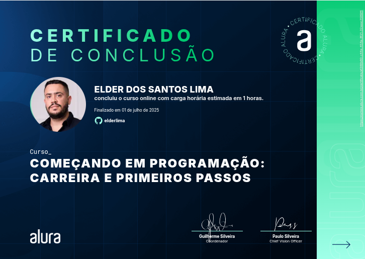
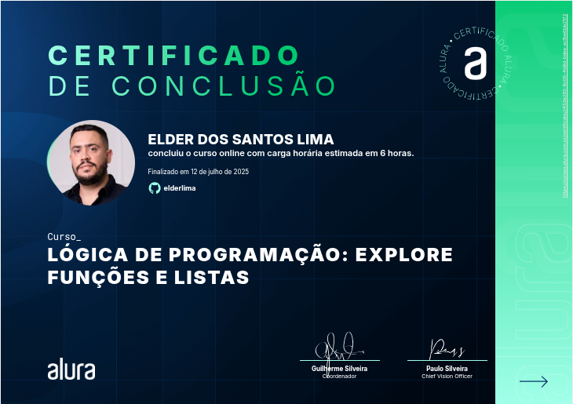
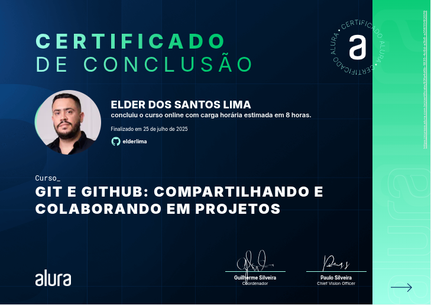

<h1>Jogo do número secreto</h1>

<h2>📄 Sobre</h2>

👋 Olá! Hoje quero compartilhar mais uma jornada que concluí: mais uma imersão no mundo da programação! 🚀

Participei de uma formação pela Alura que me guiou por importantes passos na carreira dev. Aprendi sobre as principais áreas de atuação, entendi como funciona o mercado e recebi dicas valiosas para começar com o pé direito.

Teve aquelo treino na lógica de programação: como organizar instruções de forma clara para que o computador execute tarefas corretamente. Parece simples, mas é um verdadeiro exercício de raciocínio top! 🧠

Além disso, mergulhei nas ferramentas essenciais como o Git e o GitHub — fundamentais para versionar e colaborar em projetos reais — e no VSCode, um editor que já me familiarizei por sua versatilidade.

E claro, também teve aquela reforçada em Front-End e Back-End, e como essas áreas se complementam na construção de sistemas que usamos todos os dias.

Foi mais um passo de um objetivo. E o mais importante: com ainda mais vontade de continuar! 💪

## 🚀 Tecnologias

  
  
  

## 🌐 Link no Vercel
https://elderjogosecreto.vercel.app/

## 📜 Certificados

## 💼 LinkedIn

|[ Elder dos Santos](https://github.com/elderlima)|
| :---: |
